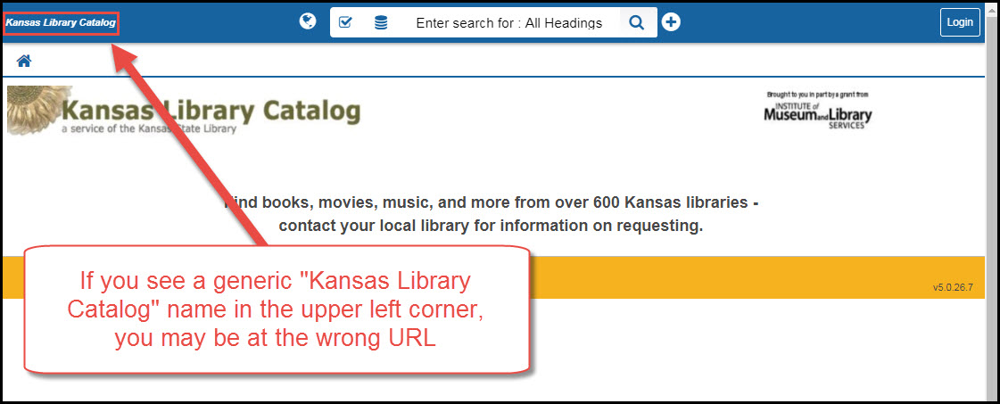

Logging in to Shareit
=====================

Example logon
-------------

Go to your `ShareIt URLs`_

.. image:: images/010.jpg

Login with your ShareIt [username and password](#shareit-usernames-and-passwords)

.. image:: images/020.jpg

A successfull login should look like this:

.. image:: images/030.jpg

If you have trouble logging in, keep reading.

ShareIt URLs
^^^^^^^^^^^^

ShareIt requires that each library logs in from a specific URL.

The format for a ShareIt login URL is

::

  http://ksuc-agent.auto-graphics.com/mvc?cid=ksuc&lid=XXX&reset=over

The difference between one library's login and another's is that you have to substitute the XXX in the middle of the above URL with your library's OCLC organization symbol. If you do not know your library's OCLC organization symbol, it can be found at

`<https://www.oclc.org/en/contacts/libraries.html>`_

Next Search Catalog URL location
--------------------------------

If you are a member of the Next consortium, you can find the ShareIt URL for your library on the left side of the home page in the staff client.

URL Troubleshooting
-------------------

If you attempt to log into ShareIt and you do not get the normal login window, you can usually overcome the problem by logging into this alternate URLs

The most common URL problem looks like this:

.. image:: images/050.jpg

.. image:: images/060.jpg

If you see either of these scenarios, you can try an alternative URL

::

  http://ksuc-agent.auto-graphics.com/mvc?cid=ksuc&lid=XXX&reset=force

The difference between this URL and the previous one is that the last part of the URL is changed from "over" to "force" (you will need to put your OCLC symbol where the XXX is in this URL too).

----

You can also try clearing the history/cache on your web browser.  In Firefox and Chrome you can accomplish this by typing CTRL-SHIFT-DELETE and following the on-screen instructions to delete all of your saved Cookies, Cache, and Content.

----

As always, if you have any problems you can contact NEKLS or the State Library of Kansas for assistance.  Next Search Catalog members can contact us at nexthelp@nekls.org.

ShareIt Usernames and Passwords
-------------------------------

If you do not know your library's username and password for ShareIt, contact the NEKLS office or the State Library of Kansas.  Next Search Catalog members can contact us at nexthelp@nekls.org.  We cannot recover any lost passwords, but we can easily create a new password for you.
